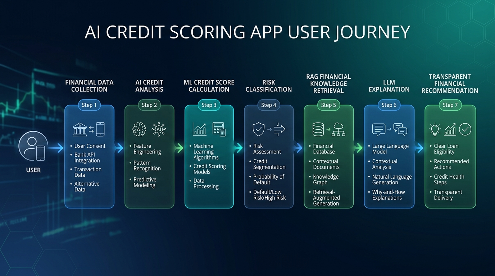
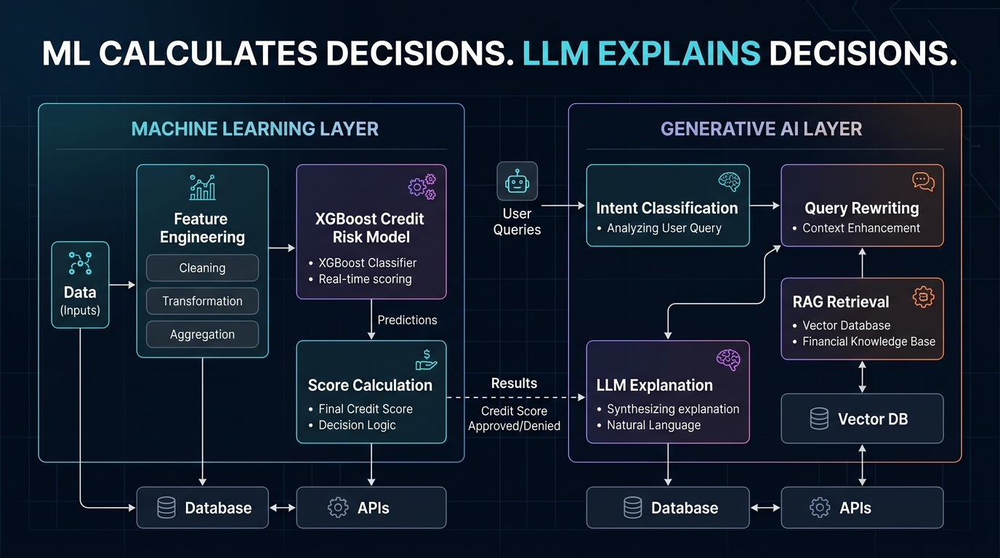
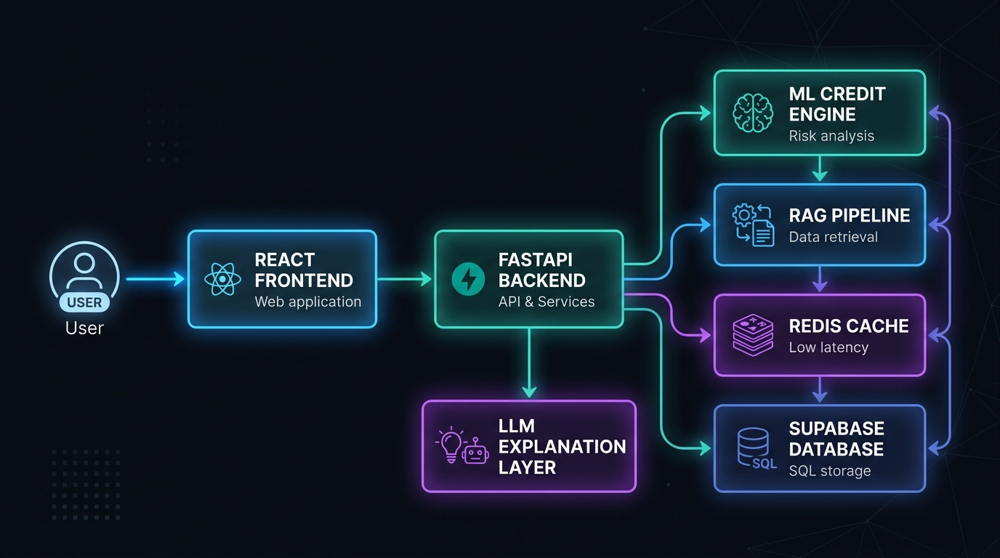
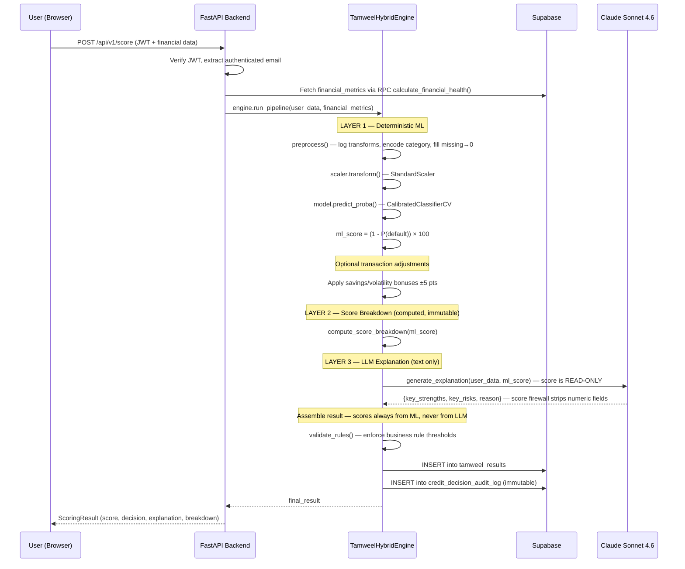
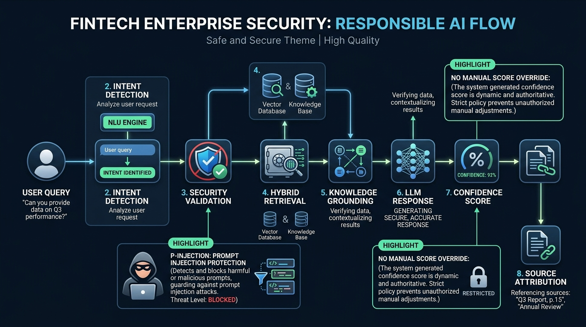

<div align="center">

<br/>

# 🏦 Tamweel AI

### *The Responsible AI Credit Scoring Platform for Jordan's Informal Economy*

<br/>

[](https://python.org)
[](https://fastapi.tiangolo.com)
[](https://react.dev)
[](https://xgboost.ai)
[](https://supabase.com)
[](https://anthropic.com)
[](LICENSE)

<br/>

> **Tamweel is not an AI chatbot.**
> It is an AI-powered Financial Decision Platform where machine learning computes risk,
> business rules validate decisions, and an LLM explains outcomes — never the reverse.

<br/>

> ⚠️ **ETHICS & DATA PRIVACY DISCLAIMER:** 
> **No real banking data, financial records, or Personally Identifiable Information (PII) is used, stored, or processed in this project.** All datasets, financial profiles, and transactions are **100% synthetically generated** strictly for demonstration and hackathon evaluation purposes using mathematically modeled probability distributions.

<br/>

---

</div>

## 📖 Table of Contents

- [Vision](#-vision)
- [The Problem](#-the-problem)
- [The Solution](#-the-solution)
- [Key Features](#-key-features)
- [Architecture Overview](#-architecture-overview)
- [System Architecture](#-system-architecture)
- [End-to-End Workflow](#-end-to-end-workflow)
- [Machine Learning Pipeline](#-machine-learning-pipeline)
- [Financial Decision Engine](#-financial-decision-engine)
- [Retrieval-Augmented Generation (RAG)](#-retrieval-augmented-generation-rag)
- [Security & Responsible AI](#-security--responsible-ai)
- [Technology Stack](#-technology-stack)
- [Project Structure](#-project-structure)
- [Installation](#-installation)
- [Configuration](#-configuration)
- [Running the Project](#-running-the-project)
- [API Overview](#-api-overview)
- [Database Schema](#-database-schema)
- [Performance & Validation](#-performance--validation)
- [Future Roadmap](#-future-roadmap)
- [Acknowledgements](#-acknowledgements)

---

## 🌟 Vision

More than **70% of Jordan's working population** operates in the informal economy — Uber drivers, food delivery riders, freelance designers, Instagram store owners, home-based entrepreneurs, and daily construction workers. These individuals have no payslip, no formal credit history, and no access to traditional bank loans.

Banks reject them not because they cannot repay, but because the systems banks use were built for a different era — one with employment contracts and physical credit bureaus.

**Tamweel exists to change that.**

By combining cutting-edge machine learning, production-grade AI engineering, and deep financial domain expertise, Tamweel builds a credit score from the financial signals that actually matter: transaction regularity, bill payment history, wallet activity, income stability, and behavioral patterns from digital payment platforms like ZainCash, CliQ, and gig economy apps.

---

## 🔴 The Problem

Traditional credit scoring fails the informal worker in three fundamental ways:

| Challenge | What Banks Do | Why It Fails |
|---|---|---|
| **No Payslip** | Require formal employment letter | Gig workers, freelancers, and SME owners have no such document |
| **No Credit Bureau Entry** | Reject applicants with no history | Absence of history ≠ bad credit behavior |
| **No Bank Account Activity** | Require 6-month bank statement | Digital wallet users (ZainCash, CliQ) are invisible to this check |

The result: an entire generation of productive, financially responsible workers is locked out of micro-financing — the very tool that could transform their lives.

---

## ✅ The Solution



Tamweel is a **full-stack AI financial platform** that:

1. **Evaluates alternative financial signals** — income stability, bill reliability, wallet transaction volume, balance-to-income ratio, and profession context.
2. **Applies a calibrated XGBoost model** trained to predict default probability from these real-world signals.
3. **Enforces immutable business rules** that cannot be overridden by any AI model.
4. **Provides Arabic-language explanations** generated by Claude, strictly grounded in the actual data and the actual decision — never fabricating outcomes.
5. **Logs every decision to a tamper-evident audit trail** for regulatory transparency and model governance.

---

## ⚡ Key Features

- 🧠 **XGBoost Credit Risk Engine** — probability-calibrated, production-grade ML model
- 🔥 **AI Firewall Architecture** — LLM cannot alter, override, or influence any numeric decision
- 🌐 **Hybrid RAG Chat Assistant** — bilingual (Arabic/English) financial advisor grounded in real policy documents
- 📊 **Real-Time Financial Intelligence** — 6-month transaction analysis with savings rate, volatility, and category breakdown
- 🛡️ **Immutable Audit Logging** — every credit decision is stored with model version, input features, and LLM explanation
- 🔐 **JWT Authentication + bcrypt** — stateless auth with role-based access (user / sponsor / admin)
- 📋 **Score Simulator** — what-if calculator for users to model their own score improvements
- 📂 **Dynamic Policy Ingestion** — sponsors can upload PDF policy documents for live RAG indexing
- 📈 **Sponsor Portfolio Dashboard** — aggregate view of all applicants with risk distribution analytics
- ⚡ **Redis Smart Cache** — reduces LLM calls for cacheable generic queries with 24-hour TTL
- 🔄 **Query Rewriter** — resolves ambiguous follow-up questions before RAG retrieval

---

## 🤖 Hybrid AI Pipeline



---

## 🏛️ Architecture Overview

> This is the most important architectural principle in Tamweel. Read this carefully.

Tamweel is built on a **strict three-layer decision hierarchy**:

```
┌─────────────────────────────────────────────────────────┐
│                   LAYER 1: ML ENGINE                    │
│                                                         │
│   XGBoost Classifier → predict_proba() → ML Score      │
│   Calibrated probabilities → deterministic output       │
│                                                         │
│   ⚠️  THIS IS THE ONLY LAYER THAT COMPUTES RISK         │
└────────────────────────┬────────────────────────────────┘
                         │  ml_score (immutable)
                         ▼
┌─────────────────────────────────────────────────────────┐
│                LAYER 2: BUSINESS RULES                  │
│                                                         │
│   Score ≥ 80 → Approved (up to 1000 JOD)               │
│   Score ≥ 60 → Approved (up to 600 JOD)                 │
│   Score ≥ 45 → Conditional (up to 300 JOD)             │
│   Score ≥ 30 → Conditional (up to 150 JOD)             │
│   Score < 30 → Rejected                                 │
│                                                         │
│   Hard overrides: late bills ≥ 4, income < 50 JOD      │
│                                                         │
│   ⚠️  BUSINESS RULES CANNOT BE OVERRIDDEN BY AI        │
└────────────────────────┬────────────────────────────────┘
                         │  final_score, decision (immutable)
                         ▼
┌─────────────────────────────────────────────────────────┐
│                  LAYER 3: LLM EXPLAINER                 │
│                                                         │
│   Claude Sonnet 4.6 → Arabic explanation only           │
│   Receives score as READ-ONLY input                     │
│   Returns: key_strengths, key_risks, reason (text)      │
│                                                         │
│   Score firewall strips any numeric fields the LLM      │
│   attempts to return. The LLM has ZERO write access     │
│   to any numeric decision field.                        │
│                                                         │
│   ⚠️  LLM EXPLAINS DECISIONS. IT DOES NOT MAKE THEM.  │
└─────────────────────────────────────────────────────────┘
```

This separation is not a convention. It is enforced architecturally in code.

---

## 🔧 System Architecture



*The diagram above provides a high-level view of the Tamweel AI system. Below is the detailed component breakdown.*

```mermaid
graph TB
    subgraph Frontend["🖥️ Frontend (React 19 + Vite)"]
        UI[User Dashboard]
        SD[Sponsor Dashboard]
        Chat[AI Chat Interface]
        Sim[Score Simulator]
    end

    subgraph Backend["⚙️ Backend (FastAPI + Uvicorn)"]
        Auth[JWT Auth Layer]
        Score[/api/v1/score]
        ChatAPI[/api/v1/chat]
        Insights[/api/v1/insights]
        Analytics[/api/v1/analytics]
        Upload[/api/v1/admin/upload-policy]
    end

    subgraph ML["🧠 ML Pipeline (ml_pipeline/)"]
        Gen[generate_data.py]
        Train[train_model.py]
        Engine[TamweelHybridEngine]
        RAG[rag_engine.py]
    end

    subgraph AIServices["🤖 AI Services"]
        Claude["Claude Sonnet 4.6\n(Explanation Only)"]
        DeepSeek["DeepSeek Chat\n(Chat Assistant)"]
        Gemini["OpenAI Embeddings\n(RAG Vector Search)"]
        OpenRouter["OpenRouter\n(Fallback Gateway)"]
    end

    subgraph Database["🗄️ Supabase (PostgreSQL + pgvector)"]
        Results[(tamweel_results)]
        Audit[(credit_decision_audit_log)]
        Tx[(transactions)]
        Chunks[(policy_chunks)]
        Users[(user_financial_intelligence)]
    end

    subgraph Cache["⚡ Cache Layer"]
        Redis[Redis\n24h TTL]
        IntCache[Intelligence Cache\nIn-Memory]
    end

    UI --> Auth
    SD --> Auth
    Chat --> ChatAPI
    Auth --> Score
    Score --> Engine
    Engine --> Claude
    Engine --> Results
    Engine --> Audit
    ChatAPI --> DeepSeek
    ChatAPI --> OpenRouter
    ChatAPI --> Gemini
    ChatAPI --> Redis
    Insights --> IntCache
    Insights --> Tx
    Upload --> Chunks
    Gen --> Train
    Train --> Engine
```

---

## 🔄 End-to-End Workflow

How a loan request flows through Tamweel from submission to decision:



---

## 📸 System Demonstration

### 1. Personal Credit Score Explanation

*AI-generated personalized financial analysis using verified user profile data.*

### 2. Credit Improvement Recommendations

*Actionable recommendations generated from spending behavior analysis.*

### 3. AI Security Protection

*Prompt injection attempt blocked by financial safety controls.*

---

## 🧠 Machine Learning Pipeline

### Why XGBoost?

Tamweel does not use a Large Language Model to compute credit decisions. This is a deliberate, principled engineering choice.

| Property | XGBoost | LLM (GPT/Claude) |
|---|---|---|
| **Determinism** | ✅ Identical input → identical output | ❌ Stochastic by design |
| **Auditability** | ✅ Feature importance, SHAP values | ❌ Opaque reasoning |
| **Speed** | ✅ Sub-millisecond inference | ❌ 2–8 second API latency |
| **Regulatory compliance** | ✅ Explainable, reproducible | ❌ Cannot be audited |
| **Hallucination risk** | ✅ None — mathematical output | ❌ Can fabricate reasoning |
| **Calibration** | ✅ Sigmoid-calibrated probabilities | ❌ No calibration concept |

LLMs are brilliant at language. They are dangerous as financial calculators. In Tamweel, they are used only for what they are actually good at: explaining decisions in clear, empathetic Arabic prose.

### Data Generation (`generate_data.py`)

The synthetic training dataset is generated using a **realistic latent-variable model** rooted in financial economics:

1. **Profile stratification** — five behavioral archetypes: `excellent`, `good`, `fair`, `poor`, `risky`
2. **Latent risk score** — computed using log-odds with realistic financial factors:
   - Penalties: `late_bills_count × 0.8`, `existing_loans × 0.6`
   - Mitigants: income stability, bill reliability, wallet activity, balance-to-income ratio
3. **Stochastic noise** — `Normal(0, 0.5)` applied to latent risk to prevent over-determinism
4. **Probability of Default (PD)** — converted via sigmoid function: `PD = 1 / (1 + e^(-latent_risk))`
5. **Binary label** — sampled from `Binomial(1, PD)` — not threshold-based, eliminating target leakage

This approach ensures the training signal is **statistically meaningful** and avoids the mathematical circularity of generating labels from the same features the model will learn.

**12 Financial Features:**

| Feature | Economic Meaning |
|---|---|
| `avg_monthly_income_jod` | Monthly income baseline (log-transformed) |
| `income_stability_score` | Regularity of income over time [0,1] |
| `income_source_count` | Diversification of income streams |
| `late_bills_count` | Historical payment failures |
| `bill_reliability_pct` | % of bills paid on time |
| `total_bills_checked` | Credit history depth |
| `current_balance_jod` | Immediate liquidity (log-transformed) |
| `wallet_tx_count` | Digital payment activity volume |
| `wallet_total_volume_jod` | Total wallet throughput (log-transformed) |
| `balance_to_income_ratio` | Savings behavior proxy |
| `existing_loans` | Current debt burden |
| `profession_category` | Informal economy sector (gig/freelance/business/daily) |

### Training Pipeline (`train_model.py`)

```
Dataset (5,000 synthetic records)
    │
    ├── Log transform: income, balance, wallet_volume
    ├── LabelEncode: profession_category → integer
    ├── fillna(0): train-serve consistency
    │
    ├── Stratified split:
    │   ├── 80% → Training set
    │   ├── 10% → Calibration set (validation)
    │   └── 10% → Final test set (held-out, never seen by model)
    │
    ├── StandardScaler (fit on train only)
    │
    ├── XGBClassifier (300 estimators, max_depth=6, learning_rate=0.05)
    │   ├── scale_pos_weight: auto-computed for class imbalance
    │   ├── eval_metric: AUC
    │   └── Regularization: gamma=0.1, reg_alpha=0.1, reg_lambda=1.0
    │
    ├── CalibratedClassifierCV (sigmoid, cv=2)
    │   └── FrozenEstimator prevents re-training during calibration
    │       (eliminates calibration-set leakage)
    │
    └── Serialized artifacts:
        ├── tamweel_xgboost_classifier.pkl
        ├── scaler.pkl
        ├── label_encoder.pkl
        ├── feature_names.json
        ├── model_metadata.json
        └── feature_importance.csv
```

### Feature Importance

From the trained model (`feature_importance.csv`):

| Rank | Feature | Importance |
|---|---|---|
| 1 | `late_bills_count` | **38.2%** |
| 2 | `bill_reliability_pct` | **24.8%** |
| 3 | `income_stability_score` | 7.7% |
| 4 | `existing_loans` | 4.6% |
| 5 | `income_source_count` | 4.2% |
| 6 | `current_balance_jod` | 3.5% |
| 7–12 | (remaining features) | 17.0% |

Bill payment behavior dominates — consistent with what financial economists know: **past payment behavior is the strongest predictor of future payment behavior.**

### Train-Serve Consistency

A critical production concern is **train-serve skew** — when preprocessing during training differs from preprocessing during inference. Tamweel addresses this explicitly:

- Both `train_model.py` and `hybrid_engine.py` apply identical log transforms to skewed features
- Both use `fillna(0)` for missing values
- The `StandardScaler` is serialized and loaded identically at inference time
- The `LabelEncoder` handles unseen profession categories with a `0` fallback at inference

---

## 💳 Financial Decision Engine

### The Hybrid Engine (`hybrid_engine.py`)

The `TamweelHybridEngine` class is the orchestration core of the platform. It implements the three-layer decision pipeline described above with an additional important mechanism:

**Transaction Analytics Integration**  
Beyond the static ML features, the engine optionally incorporates live transaction metrics computed from the user's actual spending history:

```python
if savings_rate < 0.10 or volatility > 500:
    ml_score -= 5   # Penalty for low savings or erratic spending
if reliability >= 3:
    ml_score += 5   # Bonus for consistent bill payments
```

**Bias Mitigation: 1% Exploration Cohort**  
To prevent automation of historical biases and ensure the model does not systematically exclude any demographic:

```python
# For score < 30 profiles: 1% random approval for bias detection
if random.random() < 0.01:
    result['decision'] = "Approved (Exploration Cohort)"
    result['approved_amount_jod'] = min(requested_amount, 100)
```

This follows the principle that any automated system making consequential decisions about people's access to financial services must have a mechanism to surface cases where the model might be systematically wrong.

**Hard Override Rules**  
Business rules that cannot be overridden by any AI component:

- `late_bills_count >= 4` AND `score > 50` → cap score at 50, downgrade to Conditional
- `avg_monthly_income_jod < 50 JOD` → automatic rejection (minimum living wage constraint)

### Score to Decision Mapping

```
Score Range    Decision              Max Approved Amount
──────────── ─────────────────── ──────────────────────
  80 – 100   Approved             1,000 JOD
  60 –  79   Approved               600 JOD
  45 –  59   Conditional Approval   300 JOD
  30 –  44   Conditional Approval   150 JOD
   0 –  29   Rejected                 0 JOD
```

### Why This Is Safer Than LLM-Based Decisions

When an LLM makes financial decisions:
- It can be manipulated by prompt injection
- It produces different results on different runs
- It cannot be audited for regulatory compliance
- It may hallucinate financial rules that don't exist
- It cannot produce calibrated probabilities

When deterministic ML makes the decision and an LLM explains it:
- The decision is reproducible and auditable
- Calibrated probabilities map directly to real-world default rates
- The explanation is constrained to the actual data and actual outcome
- No amount of prompt engineering can change the underlying mathematical score

---

## 🔍 Retrieval-Augmented Generation (RAG)

Tamweel's AI chat assistant is not a generic chatbot. It is a **financially grounded assistant** that answers questions about credit policy, spending behavior, and financial improvement — using only verified information.

### RAG Architecture

```
User Query (Arabic or English)
        │
        ▼
┌───────────────────┐
│  Query Rewriter   │  Resolves ambiguous follow-ups using conversation history
│  (DeepSeek LLM)   │  "What about freelancers?" → "What are the loan requirements for freelancers?"
└────────┬──────────┘
         │
         ▼
┌───────────────────┐
│ Intent Classifier │  Classifies: GENERIC | PROFILE | TRANSACTIONS | DTI | FINANCIAL_ADVICE | FULL_REVIEW
│ (Keyword-based)   │  Routes to appropriate data fetcher (no LLM cost)
└────────┬──────────┘
         │
         ▼
┌───────────────────┐     ┌──────────────────────────────────┐
│  Data Fetcher     │────▶│ Supabase: user profile, score,   │
│  (Per-intent)     │     │ transactions, intelligence cache  │
└────────┬──────────┘     └──────────────────────────────────┘
         │
         ▼
┌─────────────────────────────────────────────────────────┐
│             Hybrid Vector Search (pgvector)              │
│                                                         │
│  embed_query() → OpenAI text-embedding-3-small (768d)  │
│  hybrid_search_policy_chunks() RPC:                     │
│    - Semantic search (cosine similarity)                │
│    - Keyword search (full-text)                         │
│    - Reciprocal Rank Fusion (RRF)                       │
└────────┬────────────────────────────────────────────────┘
         │
         ▼
┌───────────────────┐
│  Redis Cache      │  24h TTL for generic/cacheable queries (intent = GENERIC)
│  (Smart Cache)    │  Cache key = SHA256(normalized_query + doc_ids + version)
└────────┬──────────┘
         │
         ▼
┌─────────────────────────────────────────────────────────┐
│              Context Assembler                          │
│                                                         │
│  System prompt: grounding rules, citation requirements  │
│  <FP> tag: user's verified financial data (minified)    │
│  <knowledge_base>: retrieved policy chunks              │
│  Sliding window history: last 6 turns                  │
└────────┬────────────────────────────────────────────────┘
         │
         ▼
┌───────────────────┐     ┌──────────────────┐
│  DeepSeek Chat    │────▶│ OpenRouter/GPT-4o │  (fallback on failure)
│  (Primary LLM)    │     │  -mini (Fallback) │
└────────┬──────────┘     └──────────────────┘
         │
         ▼
JSON Response: {answer, support_score, sources, suggested_followups}
```

### Strict Grounding Rules

The context assembler enforces these rules in every system prompt:

1. **No fabrication** — only use provided chunks; never use pre-trained memory
2. **No estimation** — never calculate percentages not explicitly stated in the source
3. **No merging** — never combine statistics from different policy documents
4. **Contradiction detection** — if chunks conflict, state the contradiction explicitly
5. **Claim support** — every factual claim must cite a chunk ID (`[C1]`, `[C2]`)
6. **Arabic-first** — respond in Arabic if the user writes in Arabic

### Policy Ingestion

Sponsors can upload PDF policy documents via the admin panel. The ingestion pipeline:
1. Extracts text using `PyMuPDF`
2. Chunks into semantic segments
3. Embeds using OpenAI `text-embedding-3-small` (768 dimensions, L2-normalized)
4. Stores in Supabase `policy_chunks` table with `pgvector`
5. The RPC `hybrid_search_policy_chunks` performs hybrid semantic + keyword search with RRF

---

## 🔐 Security & Responsible AI



### Authentication & Authorization

| Mechanism | Implementation |
|---|---|
| **JWT Tokens** | HS256, 7-day expiry, `JWT_SECRET_KEY` env var (mandatory — server refuses to start without it) |
| **Password Hashing** | `bcrypt` with salt — plaintext passwords never stored |
| **Role-Based Access** | `user` / `sponsor` / `admin` — read from DB `role` column (never from email pattern) |
| **CORS** | Configurable via `CORS_ALLOWED_ORIGINS` env var — no wildcard in production |

### API Security

- **Ownership assertion** — every endpoint verifies `JWT email == requested resource email`
- **IDOR prevention** — `get_insights()` ignores path parameter, reads from JWT `sub` claim
- **File upload validation** — allowlist: `.pdf` and `.txt` only; max 10 MB enforced server-side
- **Sponsor-gated routes** — `/api/v1/admin/upload-policy`, `/api/v1/results/all_users` require `role=sponsor`

### AI Firewall (Score Integrity)

The score firewall is a **multi-layer defense** ensuring the LLM cannot alter any numeric outcome:

```python
# In rag_engine.py — generate_explanation()
# Layer 1: System prompt instructs LLM not to return numeric fields
# Layer 2: Parser extracts only allowed text fields
# Layer 3: Explicit pop() of any forbidden numeric key the LLM returned

for forbidden_key in ("ml_score", "llm_adjusted_score", "final_score",
                      "decision", "approved_amount_jod", "risk_level"):
    parsed.pop(forbidden_key, None)

# Layer 4: In hybrid_engine.py run_pipeline()
# Score fields are ALWAYS set from ML output AFTER the LLM returns
# LLM output is merged only for text fields
```

### Audit Logging

Every credit decision generates an **immutable audit log entry** in `credit_decision_audit_log`:

```sql
CREATE TABLE credit_decision_audit_log (
    id               BIGINT GENERATED BY DEFAULT AS IDENTITY PRIMARY KEY,
    applicant_email  TEXT NOT NULL,
    model_version    TEXT NOT NULL DEFAULT 'xgboost-classifier-v1',
    input_features   JSONB NOT NULL,   -- Full input for replay
    ml_score_raw     NUMERIC(6,2) NOT NULL,
    final_score      NUMERIC(6,2) NOT NULL,
    score_breakdown  JSONB NOT NULL,
    risk_level       TEXT NOT NULL,
    decision         TEXT NOT NULL,
    approved_amount_jod INT NOT NULL,
    explanation_reason  TEXT,          -- LLM text (no numeric influence)
    explanation_model   TEXT,          -- 'claude-sonnet-4-6' — model provenance tracked
    financial_metrics_snapshot JSONB   -- Snapshot of transaction metrics at decision time
);
```

**Application-level ownership assertion** — before any audit write, the backend verifies:
```python
if asserted_email (from JWT) != applicant_email:
    # Block — refuse to write audit record under wrong identity
    return final_result
```

This makes spoofed audit records structurally impossible.

### Responsible AI Principles

| Principle | Implementation |
|---|---|
| **Determinism** | XGBoost model produces identical output for identical input |
| **Explainability** | Score breakdown (income_stability, bill_history, financial_health) decomposed for every decision |
| **Fairness** | 1% exploration cohort prevents systematic exclusion of high-risk segments |
| **Auditability** | Full input-output trace stored with model version and timestamp |
| **Human oversight** | Business rules enforced at code level; no ML decision is final without rule validation |
| **Non-discrimination** | `profession_category` included as context, not as a discriminatory filter |
| **Transparency** | LLM explanation grounded in real data with Arabic explanation for applicants |

---

## 🛠️ Technology Stack

### Backend
| Component | Technology | Purpose |
|---|---|---|
| Web Framework | FastAPI 0.109 + Uvicorn | High-performance async REST API |
| ML Framework | XGBoost + scikit-learn | Credit risk classification |
| Calibration | `CalibratedClassifierCV` + `FrozenEstimator` | Probability calibration without leakage |
| LLM (Explanation) | Anthropic Claude Sonnet 4.6 | Arabic credit decision explanation |
| LLM (Chat) | DeepSeek Chat via OpenRouter | Bilingual financial chat assistant |
| LLM (Fallback) | OpenAI GPT-4o-mini via OpenRouter | Resilient LLM gateway |
| Embeddings | OpenAI text-embedding-3-small (768d) | RAG vector search |
| Database | Supabase (PostgreSQL + pgvector) | Structured data + vector store |
| Cache | Redis (async) | Smart query cache, 24h TTL |
| Auth | PyJWT + bcrypt | Stateless JWT authentication |
| Data | pandas, numpy, scikit-learn | Feature engineering, training |
| HTTP Resilience | tenacity | Exponential backoff, 3 retries |
| PDF Ingestion | PyMuPDF | Policy document extraction |

### Frontend
| Component | Technology | Purpose |
|---|---|---|
| Framework | React 19 + Vite 8 | Fast, modern SPA |
| Styling | Tailwind CSS v4 | Utility-first design system |
| Animation | Framer Motion 12 | Premium micro-animations |
| State | Zustand 5 | Lightweight global state |
| Charts | Recharts 3 | Financial analytics charts |
| Forms | React Hook Form + Zod | Type-safe form validation |
| Routing | React Router v7 | Client-side navigation |
| Icons | Lucide React | Consistent icon system |
| Markdown | React Markdown + remark-gfm | AI response rendering |

### Infrastructure
| Component | Technology |
|---|---|
| Database | Supabase (PostgreSQL 15, pgvector) |
| Row Level Security | Supabase RLS with service-role key |
| Vector Search | pgvector + hybrid RRF search |
| Environment | `.env` per layer (root, backend, frontend, MVP) |

---

## 📁 Project Structure

```
Tamweel_test/
│
├── 📂 ml_pipeline/              # ML Pipeline
│   ├── generate_data.py         # Synthetic dataset generator (latent PD model)
│   ├── train_model.py           # XGBoost training + calibration pipeline
│   ├── rag_engine.py            # Claude explanation engine + score firewall
│   ├── models/                  # Serialized ML artifacts
│   │   ├── tamweel_xgboost_classifier.pkl
│   │   ├── scaler.pkl
│   │   ├── label_encoder.pkl
│   │   ├── feature_names.json
│   │   ├── model_metadata.json  # Hyperparameters + metrics snapshot
│   │   └── feature_importance.csv
│   └── data/
│       └── tamweel_training_data.csv
│
├── 📂 backend/                  # FastAPI Backend
│   ├── app/
│   │   ├── main.py              # All API routes (839 lines)
│   │   ├── schemas.py           # Pydantic models for API contract
│   │   ├── ml/
│   │   │   ├── hybrid_engine.py # Core orchestration engine
│   │   │   └── models/          # Symlink to MVP models
│   │   ├── pipeline/
│   │   │   ├── embed.py         # OpenAI embeddings (batched, normalized)
│   │   │   ├── query_rewriter.py # LLM-powered query resolution
│   │   │   ├── extract.py       # PDF text extraction
│   │   │   └── config.py        # Pipeline settings
│   │   └── services/
│   │       ├── context_assembler.py   # LLM message assembly
│   │       ├── intent_classifier.py   # Keyword-based intent routing
│   │       ├── data_fetcher.py        # Per-intent data retrieval
│   │       ├── financial_intelligence.py # 6-month transaction analysis
│   │       ├── intelligence_cache.py  # Computed intelligence caching
│   │       ├── redis_cache.py         # Redis query cache
│   │       └── question_cache.py      # Frequent question detection
│   └── requirements.txt
│
├── 📂 frontend/                 # React Frontend
│   ├── src/
│   │   ├── features/
│   │   │   ├── dashboard/
│   │   │   │   ├── UserDashboard.jsx     # Full credit score dashboard
│   │   │   │   ├── SponsorDashboard.jsx  # Portfolio analytics view
│   │   │   │   ├── ScoreSimulator.jsx    # What-if score calculator
│   │   │   │   ├── SpendingAnalytics.jsx # Transaction charts
│   │   │   │   └── CreditScoreGauge.jsx  # Animated score gauge
│   │   │   ├── admin/
│   │   │   │   └── AdminKnowledgeUpload.jsx # PDF policy ingestion
│   │   │   └── auth/                    # Login / Register flows
│   │   ├── contexts/            # React Context providers
│   │   ├── hooks/               # Custom hooks
│   │   ├── services/            # API client functions
│   │   ├── store/               # Zustand state stores
│   │   └── routes/              # Protected route wrappers
│   └── package.json
│
├── 📂 data/                     # Generated training data (CSV)
│
├── credit_decision_audit_log.sql # Audit log schema with RLS documentation
├── add_role_column.sql           # Role-based access migration
├── hybrid_search_schema.sql      # pgvector hybrid search setup
├── launch_tamweel.py             # One-command launcher (backend + frontend)
└── README.md
```

---

## 🚀 Quick Start

### Prerequisites
- Docker & Docker Compose
- Environment variables configured

### Clone the Repository
```bash
git clone <repository-url>
cd Tamweel_test
```

### 1. Configure Environment
Copy the example environment file and fill in your keys:
```bash
cp .env.example .env
```

### 2. Run with Docker Compose
The easiest way to boot the entire platform is via Docker. This will spin up the FastAPI Backend, React Frontend, and Redis Cache.
```bash
docker compose up --build
```
- **Frontend**: Available at `http://localhost:5173`
- **Backend**: Available at `http://localhost:8000`

---

## ⚙️ Configuration

Each layer of the application requires its own `.env` file. Use the provided `.env.example` as a template.

### `backend/.env`

```env
# Database
SUPABASE_URL=https://<your-project>.supabase.co
SUPABASE_KEY=<your-service-role-key>

# Authentication — REQUIRED. Server refuses to start without this.
JWT_SECRET_KEY=<minimum-32-character-random-string>

# AI Models
ANTHROPIC_API_KEY=<your-anthropic-key>        # Claude Sonnet 4.6 (explanation)
OPENROUTER_API_KEY=<your-openrouter-key>       # DeepSeek + GPT-4o-mini + embeddings
DEEPSEEK_API_KEY=<your-deepseek-key>           # DeepSeek Chat (primary chat LLM)

# CORS (comma-separated)
CORS_ALLOWED_ORIGINS=http://localhost:5173,http://localhost:3000
```

### `ml_pipeline/.env`

```env
SUPABASE_URL=https://<your-project>.supabase.co
SUPABASE_KEY=<your-service-role-key>
ANTHROPIC_API_KEY=<your-anthropic-key>
```

### `frontend/.env`

```env
VITE_API_URL=http://localhost:8000
```

### Database Setup

Run these SQL files in your Supabase SQL editor **in order**:

```bash
1. hybrid_search_schema.sql         # pgvector + hybrid search RPC
2. credit_decision_audit_log.sql    # Audit trail table + RLS
3. add_role_column.sql              # User role column migration
4. user_connections_schema.sql      # Bank connection metadata
5. transaction_module.sql           # Transaction + financial health RPC
```

---

### ML Pipeline (Retrain from Scratch)

If you wish to retrain the XGBoost models locally:
```bash
cd ml_pipeline

# Step 1: Generate synthetic training data
python generate_data.py

# Step 2: Train, calibrate, and serialize the model
python train_model.py
```

### Demo Credentials

| Role | Email | Password |
|---|---|---|
| User | `anas@tamweel.ai` | `password123` |
| Sponsor/Admin | `admin@tamweel.ai` | `password123` |

---

## 🧪 Testing

Tamweel AI features a comprehensive CI/CD pipeline and an automated Pytest suite covering ML, API, Security, RAG, and Cache layers.

To run the tests locally:
```bash
python -m pytest tests/ -v
```

The test suite explicitly validates:
- **ML Validation**: Model determinism and correct loading.
- **API Validation**: HTTP endpoints and payload constraints.
- **RAG Validation**: Citation formatting and retrieval pipeline constraints.
- **Security Validation**: JWT authentication and unauthorized access prevention.
- **Cache Validation**: Intelligence cache integrity.

---

## 📡 API Overview

Tamweel AI automatically generates interactive OpenAPI documentation. When the backend is running, visit:
- **FastAPI Swagger UI**: [http://localhost:8000/docs](http://localhost:8000/docs)

All endpoints require a `Bearer <JWT>` Authorization header unless noted.

| Method | Endpoint | Auth | Description |
|---|---|---|---|
| `GET` | `/health` | None | System health check |
| `POST` | `/api/v1/auth/register` | None | Register new user |
| `POST` | `/api/v1/auth/login` | None | Login → JWT token |
| `POST` | `/api/v1/score` | User | Submit financial data → credit score |
| `POST` | `/api/v1/chat` | User/Sponsor | Bilingual AI financial chat |
| `POST` | `/api/v1/ai/improvement-plan` | User | Generate personalized improvement plan |
| `GET` | `/api/v1/results/{user_id}` | User | Fetch user's credit history |
| `GET` | `/api/v1/results/all_users` | Sponsor | All applicants portfolio view |
| `GET` | `/api/v1/insights/{user_email}` | User | AI-computed financial intelligence |
| `GET` | `/api/v1/analytics/spending-patterns/{email}` | User | Spending analytics + transactions |
| `POST` | `/api/v1/transactions` | User | Log new transaction |
| `POST` | `/api/v1/admin/upload-policy` | Sponsor | Ingest PDF policy document into RAG |

### Example: Credit Score Request

```bash
curl -X POST http://localhost:8000/api/v1/score \
  -H "Authorization: Bearer <JWT>" \
  -H "Content-Type: application/json" \
  -d '{
    "name": "أحمد الخالدي",
    "profession": "Uber Driver",
    "profession_category": "gig",
    "avg_monthly_income_jod": 320.50,
    "income_stability_score": 0.85,
    "income_source_count": 1,
    "late_bills_count": 1,
    "bill_reliability_pct": 92.0,
    "total_bills_checked": 12,
    "current_balance_jod": 150.0,
    "wallet_tx_count": 25,
    "wallet_total_volume_jod": 450.0,
    "balance_to_income_ratio": 0.46,
    "existing_loans": 0,
    "requested_amount_jod": 500,
    "loan_duration_months": 12
  }'
```

---

## 🗄️ Database Schema

### Core Tables

| Table | Purpose |
|---|---|
| `tamweel_results` | User profiles, credit scores, decisions, explanations |
| `credit_decision_audit_log` | Immutable audit trail for every decision (with input features, model version) |
| `transactions` | User financial transactions (income/expense by category) |
| `user_financial_intelligence` | Cached 6-month intelligence computations |
| `policy_chunks` | RAG vector store (policy document embeddings, pgvector) |
| `frequent_questions` | Cached common Q&A pairs |

### Key RPC Functions

| Function | Purpose |
|---|---|
| `hybrid_search_policy_chunks(query_text, query_embedding, match_count)` | Hybrid semantic + keyword search with RRF |
| `calculate_financial_health(target_email)` | Compute savings rate, volatility, reliability from transactions |

---

## 📊 Performance & Validation

### Model Performance (Held-Out Test Set, n=1,000)

| Metric | Value |
|---|---|
| **ROC-AUC** | **0.905** |
| **F1-Score** | 0.670 |
| **Precision** | 0.691 |
| **Recall** | 0.651 |
| **Brier Score** | 0.097 *(lower is better; well-calibrated)* |

> A Brier Score of 0.097 on a binary outcome indicates well-calibrated probabilities — the model's predicted default rates closely match observed default rates across all score bands.

### Cross-Validation

5-fold Stratified K-Fold cross-validation on full dataset:

```
CV F1 Score: 0.67XX ± [std]  (computed during training)
```

### Edge Case Regression Tests

From end-to-end validation:

| Profile | Score | Decision |
|---|---|---|
| Empty dict (all missing) | 52.6 | Rejected |
| Unseen profession category | 42.9 | Conditional Approval |
| Extreme low income (<50 JOD) | Overridden | **Rejected** (hard rule) |
| Extreme high-risk (late bills) | 25.9 | Rejected |
| Excellent profile | **94.9** | **Approved** |

---

## 🗺️ Future Roadmap

| Phase | Feature | Status |
|---|---|---|
| **v1.1** | Open Banking API integration (ZainCash, CliQ) | Planned |
| **v1.2** | SHAP value explainability per decision | Planned |
| **v1.3** | A/B testing framework for model updates | Planned |
| **v2.0** | Federated learning (train without sharing raw data) | Research |
| **v2.1** | Multi-country expansion (regional informal economies) | Research |
| **v2.2** | Loan repayment behavior tracking → model retraining loop | Planned |
| **v2.3** | Regulatory API for Central Bank of Jordan reporting | Planned |

---

## 🙏 Acknowledgements

Tamweel was built with a deep commitment to responsible AI and financial inclusion. Special acknowledgement to:

- The informal workers of Jordan whose resilience and entrepreneurship this platform exists to serve
- The open-source communities behind XGBoost, FastAPI, React, Supabase, and scikit-learn
- Anthropic for Claude Sonnet 4.6, which generates the Arabic explanations that make complex financial decisions human and understandable

---

<div align="center">

**Tamweel AI** — *Financing trust through intelligence.*

<br/>

*Built with ❤️ for Jordan's informal economy*

</div>