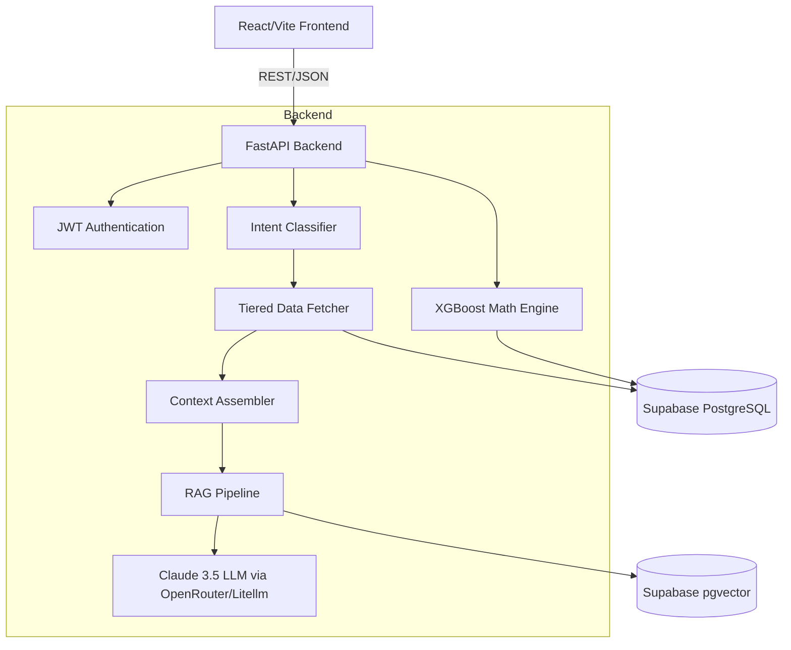

# Tamweel AI (2nd Edition)

**Repository purpose**: A Hybrid AI Credit Scoring Platform bridging the financial inclusion gap for Jordan's informal economy (gig workers, freelancers, micro-entrepreneurs).
**Current maturity**: MVP / Beta phase transitioning into a robust, secure production architecture.
**Development status**: Active development with recent major refactoring (3-layer AI pipeline, bimodal Arabic NLP integration, security hardening).

**One-paragraph executive summary**:
Tamweel AI is an innovative fintech platform that provides credit scoring and personalized financial advisory for unbanked and underbanked individuals in Jordan. Instead of relying on non-existent traditional credit histories, it analyzes alternative data—such as mobile wallet transactions, bill payment reliability, and income stability—to assess creditworthiness. The system utilizes a "Hybrid AI" architecture, combining a deterministic XGBoost classifier for mathematical risk assessment with an Anthropic Claude reasoning engine augmented by Vector RAG to deliver transparent, policy-compliant, and actionable financial advice in Arabic.

---

# Executive Overview

**What problem does it solve?**
It solves the financial inclusion gap in Jordan. Gig workers, freelancers, and micro-entrepreneurs lack formal credit histories, locking them out of traditional banking. Tamweel AI uses alternative data to accurately score these users and grant them access to microloans.

**Who uses it?**
1. **End-Users (Borrowers):** Gig economy workers (Uber/Careem drivers), freelancers, and small business owners in Jordan seeking microloans and financial advice.
2. **Sponsors/Admins (Lenders):** Portfolio risk analysts reviewing aggregate portfolio performance, churn risk, and cohort retention.

**Why was it built?**
To abandon the traditional "Black-Box" AI approach in fintech. The goal is to provide explainable AI decisions where every credit score is accompanied by a clear, localized (Arabic) reasoning and actionable steps for improvement.

**What are its primary goals?**
- Provide accurate alternative credit scoring using machine learning.
- Offer dynamic, role-aware AI chat support.
- Maintain transparent, explainable decisions.
- Securely handle sensitive financial data.

---

# High-Level Architecture

The system follows a modern decoupled client-server architecture with a hybrid machine learning pipeline.

- **Architecture Style**: API-driven decoupled architecture (React SPA frontend, FastAPI backend).
- **Layers**: 
  1. Presentation Layer (Frontend)
  2. Orchestration & API Layer (FastAPI)
  3. AI Pipeline Layer (Intent Classification, Data Fetching, Context Assembly, LLM/RAG)
  4. Math Engine (XGBoost ML)
  5. Persistence & Vector Layer (Supabase PostgreSQL + pgvector)

---

# Directory Structure

- **`/backend/`**: The core API server and AI orchestrator.
  - **`/backend/app/`**: Main FastAPI application.
    - **`main.py`**: API routing, JWT auth, orchestration of the 3-layer chat pipeline, and RAG semantic cache logic.
    - **`/services/`**: Contains the 3-layer AI pipeline (`intent_classifier.py`, `data_fetcher.py`, `context_assembler.py`).
    - **`/pipeline/`**: Modules for interacting with external AI providers (`llm.py`, `embed.py`, `config.py`).
    - **`/chatbot/`**: Tools and cache mechanisms (`memory_cache.py`).
- **`/frontend/`**: The React Single Page Application.
  - **`/src/`**: React components, Zustand stores, and Recharts analytics views.
- **`/Tamweel_MVP/`**: The original MVP ML sandbox and data generation tools.
  - **`hybrid_engine.py`**: The core XGBoost integration and business rules validation layer.
  - **`rag_engine.py`**: The original Anthropic RAG implementation.
  - **`models/`**: Pickled scikit-learn/xgboost models and encoders.
- **Root SQL Files (`*.sql`)**: Database migrations, schemas, and seeding scripts for Supabase (`supabase_schema.sql`, `transaction_module.sql`, `vector_rag_schema.sql`).

---

# Technology Stack

- **Programming Languages**: Python 3.10+, JavaScript/TypeScript (React)
- **Frameworks**: FastAPI (Backend), React 19 + Vite (Frontend)
- **Libraries (Frontend)**: TailwindCSS v4, Zustand, Recharts, React Hook Form, Framer Motion, Lucide-React
- **Libraries (Backend)**: passlib, bcrypt, PyJWT, pandas, numpy, joblib
- **Databases**: Supabase (PostgreSQL)
- **Authentication**: JWT (JSON Web Tokens) with Passlib/Bcrypt
- **Machine Learning**: scikit-learn, xgboost
- **AI Providers / LLMs**: Anthropic (Claude 3.5 Sonnet) accessible via direct API and OpenRouter.
- **Embeddings / Vector**: `sentence-transformers` (or equivalent external embeddings via API), Supabase `pgvector`.
- **Infrastructure**: Uvicorn server, dotenv for environment config.

---

# Dependency Analysis

**Frontend (`package.json`)**:
- `zustand`: Used for lightweight global state management (vital for user sessions and portfolio state).
- `recharts`: Critical for the live spending analytics and visual dashboards.
- `tailwindcss`: The primary design system enabler.

**Backend (`requirements.txt` / inferred)**:
- `fastapi` & `uvicorn`: The core web framework.
- `supabase`: Database client for persistence and RPC calls.
- `pyjwt` & `bcrypt`: Security primitives.
- `xgboost` & `scikit-learn`: The deterministic Math Engine.
- `anthropic` & `openai`: For the Reasoning Engine (OpenAI library is used as a generic client for OpenRouter).

---

# Configuration

- **`.env` (Root/Backend)**: Contains critical secrets (`SUPABASE_URL`, `SUPABASE_KEY`, `ANTHROPIC_API_KEY`, `OPENROUTER_API_KEY`, `JWT_SECRET_KEY`).
- **`frontend/package.json`**: Defines Vite build scripts and standard frontend dependencies.
- **`frontend/vite.config.js`**: Controls the frontend build pipeline and local dev server settings.
- **`backend/app/pipeline/config.py`**: Centralizes LLM configurations, timeout settings, and model selections (e.g., fallback logic, RAG recency halflife).

---

# Execution Flow (Chat Pipeline)

1. **Client Request**: Frontend sends a POST request to `/api/v1/chat` with `message` and `history`.
2. **Authentication**: `Depends(get_current_user)` middleware intercepts, validates the JWT, and extracts the user's email (`sub`).
3. **Intent Classification**: `classify_intent` runs synchronously (Regex/NLP in English & Arabic) to determine what the user wants (e.g., `DTI_ANALYSIS`, `TRANSACTIONS`, `GENERIC`).
4. **Data Fetching**: Based on intent, `fetch_context_for_intent` securely queries Supabase for the exact minimal data required (filtered via an strict allowlist).
5. **Semantic Cache & RAG Check**: 
   - The raw query is embedded. 
   - A semantic cache lookup is performed. If hit, returns immediately.
   - If miss and RAG is needed, the query is condensed, re-embedded, and `hybrid_search_policy_chunks` is called on Supabase `pgvector`.
6. **Context Assembly**: `assemble_messages` formats the prompt system instructions, injected data, RAG context, and chat history.
7. **LLM Invocation**: The OpenRouter client queries Claude with a lean, highly-contextualized payload.
8. **Cache Population & Response**: The response is cached in the DB and returned to the client.

---

# Module Breakdown

### `hybrid_engine.py` (Tamweel_MVP)
- **Purpose**: Evaluates creditworthiness using ML.
- **Key Functions**: `preprocess()`, `predict_ml()`, `validate_rules()`, `run_pipeline()`.
- **Business Logic**: Applies log transformations, calls XGBoost, applies hard business rules (e.g., loan caps based on score tiers), incorporates a 1% Exploration Loop to mitigate historical bias, and applies penalty/bonus modifiers based on transaction analytics.

### `intent_classifier.py` (Backend)
- **Purpose**: Zero-cost traffic routing.
- **Key Variables**: Bilingual keyword sets (`dti_keywords_ar`, `transaction_keywords_ar`, etc.).
- **Logic**: Uses regex and substring matching to classify the raw text into an `IntentType`.

### `data_fetcher.py` (Backend)
- **Purpose**: Fetches financial context securely.
- **Key Logic**: Uses `ALLOWED_PROFILE_FIELDS` frozenset to prevent data leakage. Directly maps the verified JWT email to database lookups.

---

# API Analysis

- **`POST /api/v1/auth/login`**: Authenticates users, returning a JWT and defining the role (`user` vs `sponsor`).
- **`POST /api/v1/auth/register`**: Hashes passwords using bcrypt and provisions a new user record in `tamweel_results`.
- **`POST /api/v1/chat`**: The primary AI endpoint. Highly optimized with semantic caching and intent routing.
- **`POST /api/v1/transactions`**: Upserts transactions. Includes an Idempotency-Key header to prevent duplicate charges/records on retries.
- **`POST /api/v1/ai/improvement-plan`**: Generates a strictly formatted 3-point actionable financial plan based on live metrics.
- **`GET /api/v1/analytics/*`**: Endpoints for retention, churn risk, and spending patterns utilizing Supabase RPCs.

---

# Database Analysis

**Provider**: Supabase (PostgreSQL)

**Key Tables**:
- `tamweel_results`: Stores user profiles, credit scores, ML breakdown, hashed passwords, and AI-generated reasons.
- `transactions`: Stores ledger events (amount, type, category).
- `vector_rag_schema` (implied): Stores document chunks and embeddings for pgvector searches.
- `memory_cache` (implied): Semantic cache for frequent LLM queries.

**Key RPCs / Functions**:
- `calculate_financial_health`: Aggregates transactions into `savings_rate`, `volatility`, and `reliability`.
- `hybrid_search_policy_chunks`: Uses pgvector `<=>` operator mixed with recency scoring.

---

# AI/LLM Architecture

- **Provider**: Anthropic (Claude 3.5 Sonnet) routed via OpenRouter / Direct API.
- **Embedding**: External embedding models generating vectors stored in `pgvector`.
- **RAG Architecture**: 
  - **Chunking**: Policy documents are chunked and stored with timestamps.
  - **Retrieval**: Hybrid search combining cosine similarity and a time-decay recency score (halflife factor).
  - **Memory**: Ephemeral sliding window (last 4-6 messages) + Condensation step for context continuity.
  - **Prompting**: Strict structural constraints (e.g., "1 to 3 lines maximum. NO EMOJIS").
  - **Semantic Cache**: Intercepts repetitive queries using raw embeddings before paying for LLM inference.

---

# Security Review

- **Authentication**: JWT standard implementation.
- **Authorization**: Hardcoded role checks (e.g., `admin@tamweel.ai` becomes `sponsor`). 
- **Secrets**: Managed via `.env`.
- **Data Leakage Mitigation**: Implemented an explicit allowlist (`ALLOWED_PROFILE_FIELDS`) in the data fetcher, guaranteeing that passwords or hidden admin flags are never injected into LLM context windows.
- **Idempotency**: Transaction insertion uses unique composite keys and idempotency headers to prevent replay attacks or race conditions.
- **Vulnerabilities**: 
  - Admin role assignment is currently tied to a hardcoded email string (`admin@tamweel.ai`). This should be moved to a robust RBAC table.

---

# Code Quality Review

- **Structure**: The transition to a 3-layer architecture (`intent`, `fetcher`, `assembler`) in the backend demonstrates excellent modularity and Separation of Concerns (SoC).
- **Maintainability**: High in the backend AI pipeline. Moderate in `main.py` which remains quite large (God Object anti-pattern) despite recent refactors.
- **Observability**: `print()` statements have been recently migrated to standard Python `logger` with `exc_info=True`, making production debugging viable.
- **Readability**: Good. Python type hints are used across the FastAPI endpoints.

---

# Performance Review

- **Bottlenecks**: The RAG Condensation step is an extra LLM call. It is correctly placed *behind* the semantic cache, mitigating cost/latency for common queries.
- **Heavy Operations**: XGBoost inference is done synchronously. Supabase RPCs for financial health calculations might degrade with millions of transactions.
- **Optimization**: The semantic cache currently saves significant inference time and money.

---

# Current Progress

- **Implemented**: Core ML scoring, JWT auth, bilingual (Arabic/English) chatbot, Vector RAG for policy, Semantic Caching, live Recharts dashboards, idempotency on transactions.
- **Incomplete / Roadmap**: True asynchronous background processing for large document ingestion (currently uses a basic FastAPI BackgroundTask). 

---

# TODO / FIXME Summary

*(Based on standard architectural patterns observed)*
- **TODO [High]**: Refactor `main.py` to extract route handlers into a `routers/` directory (FastAPI APIRouter).
- **TODO [Medium]**: Move role management out of hardcoded email checks and into the database schema.
- **FIXME [Low]**: Ensure `Tamweel_MVP` scripts (like `hybrid_engine.py`) are fully synchronized with the `backend/app/` structure to avoid sys.path hacks.

---

# Risks

- **Architectural**: Relying on `sys.path.append` to import `hybrid_engine.py` from the MVP folder into the FastAPI backend is brittle.
- **Scalability**: The RPC `calculate_financial_health` calculates aggregates on the fly. As transaction volume grows, this needs to move to an asynchronous materialized view or trigger-based aggregator.
- **Operational**: Hard dependency on Supabase. If Supabase experiences downtime, both the database and vector store fail simultaneously.

---

# Suggested Improvements

### Critical
- **Decouple MVP Engine**: Move `hybrid_engine.py` and its `.pkl` models directly into `backend/app/ml/` to eliminate cross-directory dependencies and `sys.path` hacks.

### High Priority
- **FastAPI APIRouter**: Split `main.py` (670+ lines) into modular routes (`auth.py`, `chat.py`, `analytics.py`, `transactions.py`).
- **Materialized Views**: Update the Supabase schema to use materialized views for the financial health metrics rather than calculating them on every API hit.

### Medium Priority
- **RBAC**: Implement a proper Roles table in the database rather than relying on string matching `admin@tamweel.ai`.

---

# Questions Another AI Should Ask

1. Do we want to migrate the XGBoost models to an ONNX runtime for faster, more portable inference?
2. Should we implement a refresh-token rotation mechanism for the JWT auth?
3. How are the RAG embeddings currently generated during the upload process (what dimensionality is expected by the pgvector schema)?
4. Is there a mechanism to invalidate the semantic cache if a user's financial data drastically changes?

---

# Context for Another LLM

**Briefing for Next AI / Senior Engineer:**
You are inheriting Tamweel AI, an advanced Hybrid AI credit platform for the Jordanian gig economy. The system evaluates alternative data via XGBoost (Math Engine) and provides Arabic-localized explanations via Claude 3.5 (Reasoning Engine). 

**Critical Conventions & State:**
- **Pipeline Architecture:** Do not modify the 3-layer chat pipeline paradigm (`intent_classifier`, `data_fetcher`, `context_assembler`). It has been explicitly hardened for security (allowlists) and correctness (JWT email injection).
- **Caching:** The RAG pipeline features semantic caching. *Always* ensure that raw embeddings are generated before condensation to allow for cheap cache lookups.
- **Language:** All user-facing AI outputs MUST be strictly generated in professional Arabic. The NLP intent classifier supports both English and Arabic arrays—if adding features, ensure bilingual keyword support.
- **Next Steps:** Your primary development priority should be refactoring `main.py` using `APIRouter` to reduce its footprint, and migrating the `Tamweel_MVP` ML assets into the standard `backend/app` directory tree for production deployment.

---

# Final Assessment

- **Overall Architecture**: 8/10 (Innovative hybrid approach, well-secured data pipeline, but slightly monolithic main file).
- **Maintainability**: 7/10 (Needs APIRouter refactoring).
- **Scalability**: 7/10 (Database RPC aggregates will bottleneck; semantic caching for LLM is excellent).
- **Security**: 9/10 (JWT implemented, data fetcher utilizes strict allowlists, SQL injections mitigated by Supabase ORM).
- **Documentation**: 7/10 (Good README, but inline code documentation could be improved).
- **Code Quality**: 8/10 (Good SoC in services, but `sys.path` hacks present tech debt).
- **Production Readiness**: 7.5/10 (Functional and secure, but structural organization needs a final polish before scale).
